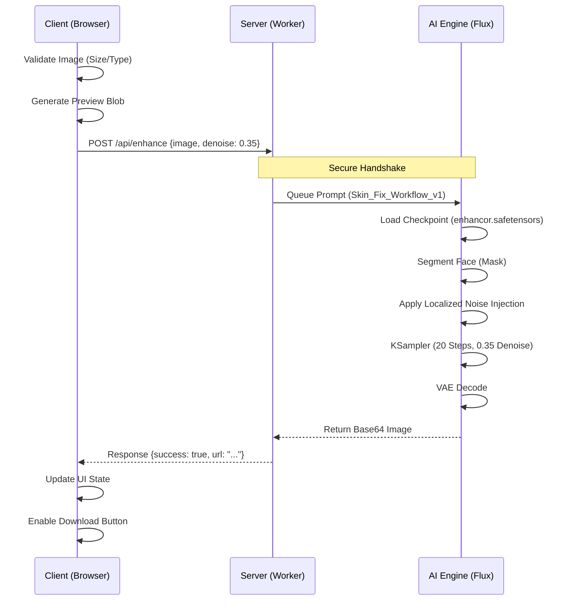

# NaturaSkin AI

<div align="center">
  
  <h1>NaturaSkin AI</h1>
  <p><strong>Authentic Skin Restoration for the AI Age</strong></p>

  [](https://github.com/sponsors/black12-ag)
  [](LICENSE)
  [](https://github.com/black12-ag)
</div>

---

**NaturaSkin AI** is a professional-grade web tool designed to fix the "plastic/glossy" look of AI-generated portraits. By injecting realistic micropores, texture, and natural imperfections using a specialized Flux-based pipeline, it transforms artificial faces into authentic, human-like images.

## 🧠 System Architecture

### 1. High-Level Data Flow

```mermaid
graph LR
    User([User]) -->|1. Upload Portrait| Web[Web Client <br/> (Vite/JS)]
    Web -->|2. Pre-process| API{API Gateway <br/> Cloudflare Functions}
    API -->|3. Inference Req| Flux[Flux.1 AI Model <br/> (ComfyUI Backend)]
    Flux -->|4. Texture Map| Refine[Enhancement Node]
    Refine -->|5. Image Result| API
    API -->|6. JSON Response| Web
    Web -->|7. Display/Download| User

    style Web fill:#2dd4bf,stroke:#0f766e,color:black
    style Flux fill:#f43f5e,stroke:#9f1239,color:white
```

### 2. Detailed Technical Workflow



## 🚀 Live Demo

[Launch App on Cloudflare Pages](https://naturaskin-ai.pages.dev) 

## 🛠️ Technology Stack

- **Frontend**: Vite + Vanilla JS (Pure Performance)
- **Styling**: Custom CSS (Teal/Natural Theme)
- **AI Core**: ComfyUI Workflow (Flux Model based)
- **Hosting**: Cloudflare Pages (Static + Functions)

## 📦 Quick Start

```bash
# Clone the repository
git clone https://github.com/black12-ag/NaturaSkin-AI.git

# Install dependencies
npm install

# Run local server
npm run dev
```

## 🔒 Copyright & License

**Copyright © 2025 Munir Kabir**.
Licensed under the [MIT License](LICENSE).

**Repository**: [https://github.com/black12-ag/NaturaSkin-AI.git](https://github.com/black12-ag/NaturaSkin-AI.git)

This availability of this open source code is made possible by **Munir Kabir** and is free for personal and commercial use.
