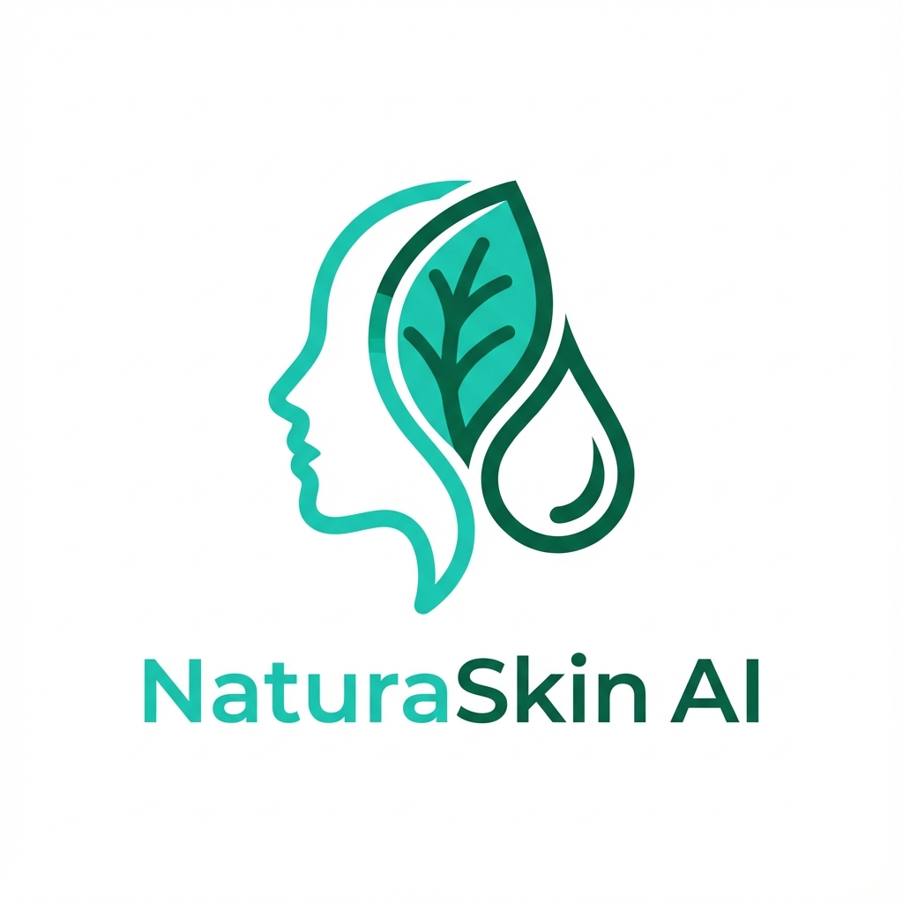

# NaturaSkin AI

  
  <h1>NaturaSkin AI</h1>
  
<strong>Professional Skin Texture Restoration for the AI Age</strong>

  
Fix "plastic" AI skin with one click.

  
  
  
  

---

## 🧐 What is NaturaSkin AI?

AI image generators (like Midjourney or Stable Diffusion) often create faces that look **too perfect**—smooth, plastic, and unnatural. 

**NaturaSkin AI** is a professional web application that fixes this problem. It uses a specialized AI pipeline to:
1.  **Analyze** the image to find skin areas.
2.  **Inject** realistic micro-texture (pores, fine grain, skin irregularities).
3.  **Enhance** the realism without changing the person's identity.

It is the perfect tool for digital artists, photographers, and AI creators who want their portraits to look **real**.

---

## ✨ Features

### 1. ⚡ Instant Demo Mode (Offline)
*   **Zero Setup**: Works immediately in your browser.
*   **Simulation**: Uses a client-side texture engine to demonstrate the effect instantly.
*   **Privacy First**: Your photos never leave your device in this mode.

### 2. 🧠 Pro AI Engine (Real Power)
*   **Deep Processing**: Connects to a powerful ComfyUI backend running the **Enhancor Skin Fix** model.
*   **Flux Model**: Uses state-of-the-art Flux.1 AI technology for cinema-quality results.
*   **Custom Control**: Adjust "Texture Intensity" (Denoise) to control how much texture is added.

### 3. ⚖️ Comparison Slider
*   **Before & After**: Drag the slider to see the exact difference between the plastic original and the natural result.
*   **Side-by-Side**: Easily compare details.

---

## 🚀 How to Use

### Step 1: Open the App
Go to [https://naturaskin-ai.pages.dev](https://naturaskin-ai.pages.dev).

### Step 2: Upload Image
Drag and drop your AI-generated portrait into the upload box.

### Step 3: Choose Your Engine
*   **For Quick Test**: Keep "AI Engine" **OFF** (Demo Mode). Click **Enhance**.
*   **For Real Results**: Turn "AI Engine" **ON**. (See Setup below).

### Step 4: Download
Use the slider to compare. If you like the result, click **Download** to save the high-quality comparison or final image.

---

## ☁️ How to Connect the Pro AI Engine (Free)

Since the AI model requires a powerful GPU, we provide a way to run it **for free** using Google Colab.

1.  **Start the Server**:
    *   [Click Here to Open our Google Colab Notebook](https://colab.research.google.com/github/black12-ag/NaturaSkin-AI/blob/master/FREE_COMFYUI_COLAB.ipynb).
    *   Click the **Play Button** (▶️) to start the machine.
    *   Wait ~5 minutes for it to install.

2.  **Get the Link**:
    *   The script will generate a public link ending in `.trycloudflare.com`.
    *   **IMPORTANT**: Copy this link and open it in a **new tab** first to verify the connection (bypass the "Visit Site" warning).

3.  **Connect**:
    *   Go back to [NaturaSkin AI](https://naturaskin-ai.pages.dev).
    *   Toggle **AI Engine** to **ON**.
    *   Paste the link into the **Server Address** box.
    *   Wait for the green **LINKED** badge.

*(Note: This connection lasts as long as your Colab tab is open. For 24/7 access, see `MANUAL.md` for paid hosting options.)*

---

## 🛠️ Technology Stack

*   **Frontend**: Vite, Vanilla JavaScript (Fast & Lightweight).
*   **Backend**: ComfyUI (Python/PyTorch).
*   **Model**: Flux.1 + Enhancor Skin Fix LoRA.
*   **Networking**: Cloudflare Tunnels + WebSockets.

---

## 🔒 Copyright & License

**Copyright © 2025 Munir Kabir**.
Licensed under the [MIT License](LICENSE).

**Repository**: [https://github.com/black12-ag/NaturaSkin-AI.git](https://github.com/black12-ag/NaturaSkin-AI.git)

This availability of this open source code is made possible by **Munir Kabir** and is free for personal and commercial use.
