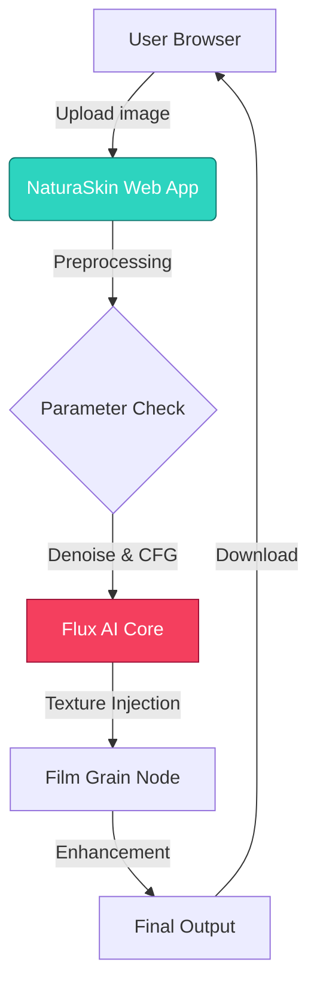
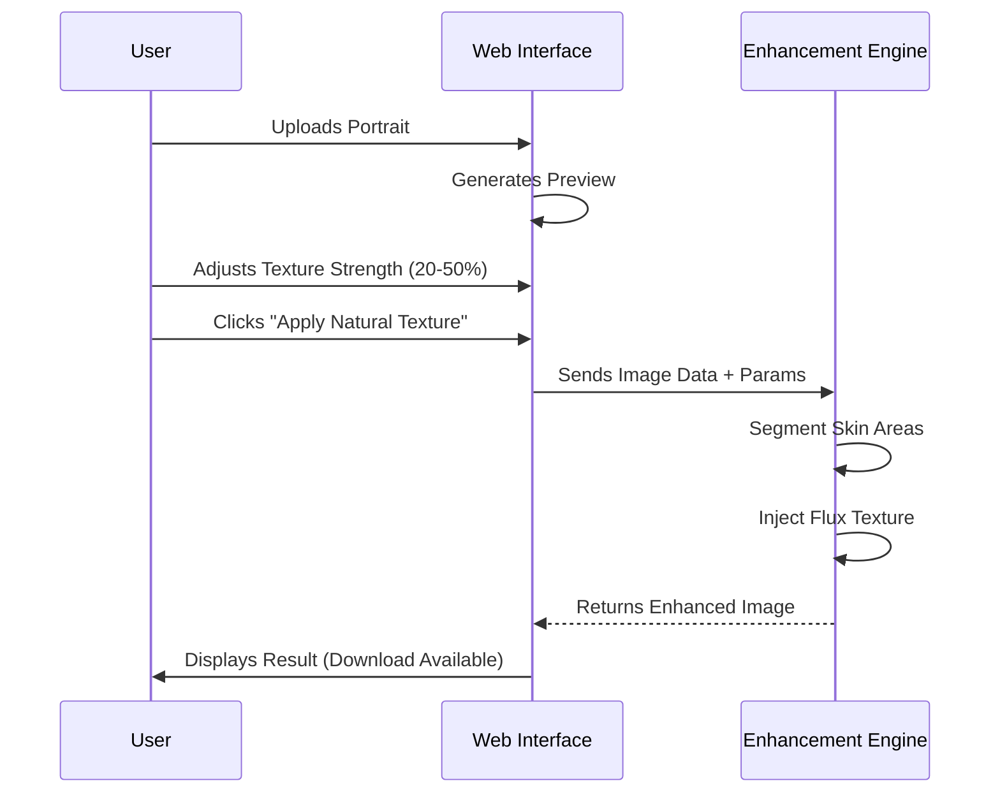

# NaturaSkin AI

<div align="center">
  
  <h1>NaturaSkin AI</h1>
  <p><strong>Authentic Skin Restoration for the AI Age</strong></p>

  [](https://github.com/sponsors/black12-ag)
  [](LICENSE)
  [](https://pages.cloudflare.com/)
</div>

---

**NaturaSkin AI** is a professional-grade web tool designed to fix the "plastic/glossy" look of AI-generated portraits. By injecting realistic micropores, texture, and natural imperfections using a specialized Flux-based pipeline, it transforms artificial faces into authentic, human-like images.

## 🧠 System Architecture

### Project Structure (Mermaid)



### How the Web App Works



## 🚀 Live Demo

[Launch App on Cloudflare Pages](https://naturaskin-ai.pages.dev) 

## 🛠️ Technology Stack

- **Frontend**: Vite + Vanilla JS (Pure Performance)
- **Styling**: Custom CSS (Teal/Natural Theme)
- **AI Core**: ComfyUI Workflow (Flux Model based)
- **Hosting**: Cloudflare Pages (Static + Functions)

## 📦 Quick Start

```bash
# Clone the repository
git clone https://github.com/black12-ag/NaturaSkin-AI.git

# Install dependencies
npm install

# Run local server
npm run dev
```

## 🔒 Copyright & License

User Code and Design Copyright © 2025 **black12-ag**.
Code released under the [MIT License](LICENSE).

This project is open source and available for personal and commercial use.
